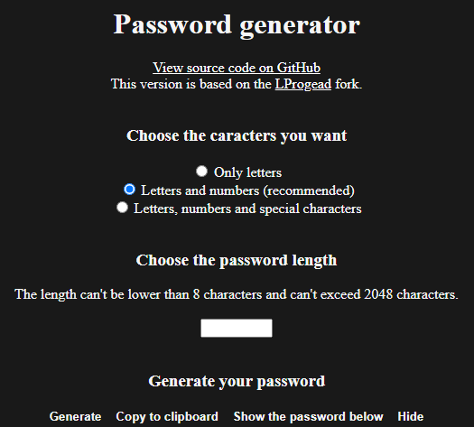

# [Password Generator](https://cyanic76.github.io/password-generator)

Here's a simple password generator.

## Features

- Generate a password with one of the available sets of characters: Basic (letters only), Medium (letters & numbers) and Hard (letters, numbers & [special characters](https://cyanic76.github.io/password-generator/#special).).
- When the password is generated, it is **not revealed** until the user choose to reveal it.
- You can copy the generated password without revealing it.

## Privacy

- The generated passwords are not saved anywhere. If you reload the page after generating one, the previously generated one will be gone.
- Want to know if the "Hard" passwords are strong? [Check here!](https://howsecureismypassword.net/)

---

Want to contribute? [Read our guidelines](https://github.com/Cyanic76/password-generator/blob/master/.github/CONTRIBUTING.md).

Password Generator by Cyanic.
